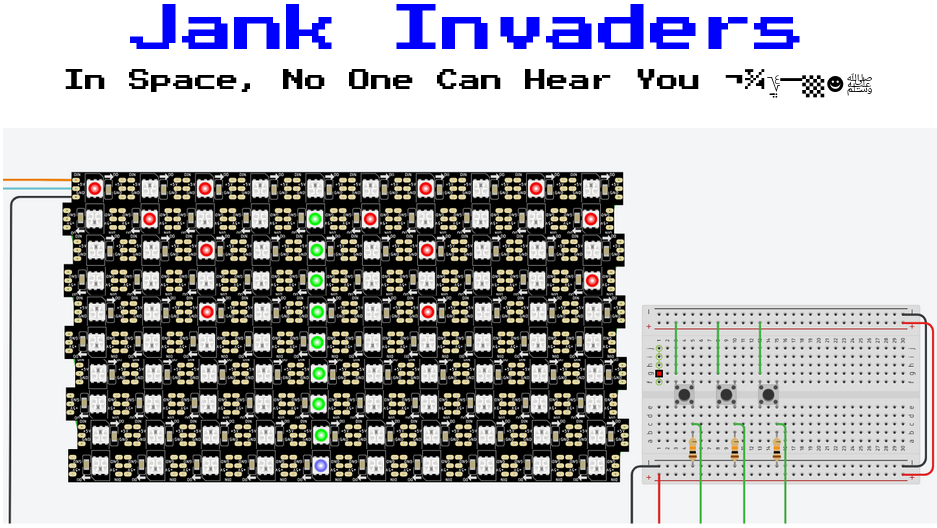
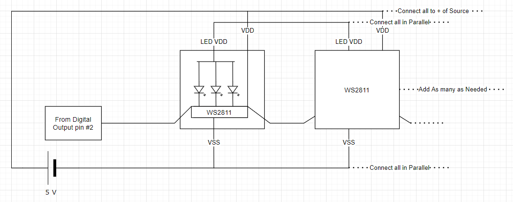
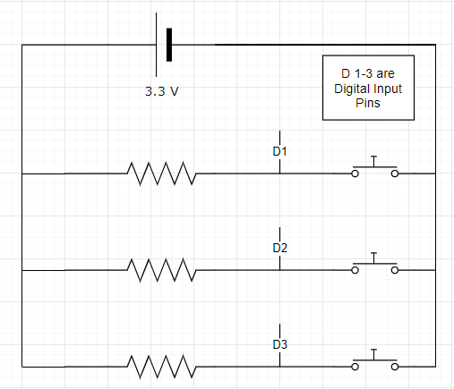
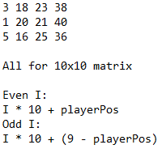
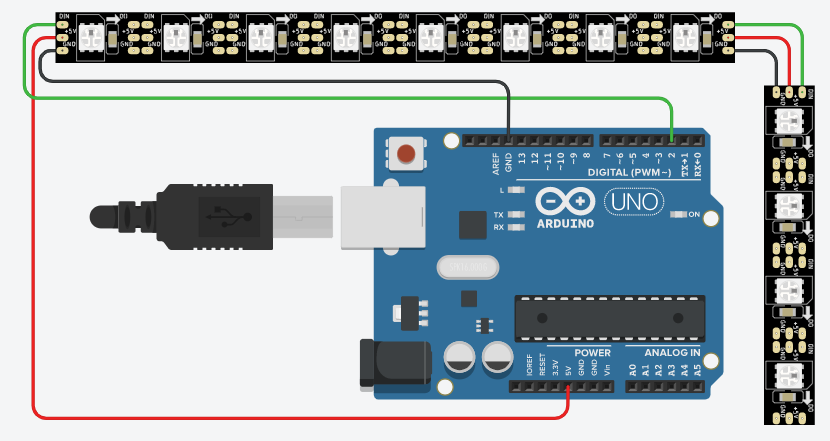

# CPSC-42_JankInvaders
This is a recreation of space invaders I made in CPSC-42 at Merced College that can run on most Arduino boards that can output to a NeoPixel strip with n^2 diodes arranged in an n by n array where n is greater than 4.

## Original Project Report:
&bspc;&bspc;&bspc;&bspc;Jank Invaders is a game I’ve created using a simulated Arduino controller on Tinkercad. It is meant to somewhat resemble Space Invaders on the Atari with a few elements born out of necessity that make it different. To play Jank Invaders, the player must fire beam lasers at the quickly spawning aliens to keep them at bay for as long as possible. There is a short cooldown after firing, but instead of shooting bullets, the beam will destroy any alien ship directly that is either in front of the player, or is about to pass in front of the player. Once the aliens have reached the bottom row, the screen will begin flashing in a beautiful, hopefully Hotline Miami-esque, collage of colors.

## Parts and Materials
    
(All parts are digital, from Tinkercad)
Arduino Uno
3 10 KΩ Resistors
3 Push Buttons
Breadboard
Wires
An {X by X} NeoPixel Matrix where X is an even number

## Construction

The physical build for this project is very simple. It may even be too simple, and I’m starting to get worried it won’t be enough for me to get a good grade. The protoboarding portion of this project simply includes three push buttons with pulldown resistors going into the digital input pins of the Arduino controller. The other physical component of this project was the NeoPixel matrix. They are individual RGB LED components that can be placed in any configuration. Each line in the LED matrix isn’t laid upon another in the same orientation. To make programming the alien movement easier, I flipped each line of LEDs so that the end of one line doesn’t have to be wired to the opposite end of the matrix, it can just be wired to an adjacent NeoPixel component. This ended up causing issues that will be mentioned later.

## Circuit Diagrams

The diagram above  shows the WS2811 components used, as well as the way they must be configured. Any square amount of these components may be used, with slight adjustments to the code being needed. 

This diagram shows how digital input is received from the pushbuttons.

## Code

The main challenge of this assignment, with a very simple physical layout, was programming. When I first started, it seemed a lot more complicated than it ended up being, but I managed to simplify the game of space invaders enough to make it fairly easy to pull off making inside of the Arduino C code. I broke the game down into two completely different areas. The bottom row of the matrix is always reserved for the player, and may as well be its own game, since it technically has no interaction with the rest of the LED matrix. The rest of the rows are for aliens and projectiles. From the perspective of the code, the matrix isn’t broken up into rows, but it is one long line. This isn’t important for the aliens, since the line is their path of movement, but it proves that I didn’t think too far ahead, since projectiles, without having some kind of code to correct it, mirror back and forth across the Y axis. To correct this, I sketched out an algorithm (image below) in notepad and then integrated it into the code.

After having the game board abstracted into a long line with imaginary rows, creating the rest of the game was fairly simple. I decided that aliens would spawn infinitely for no real reason. It was just an impulsive decision. The board was now one integer array, and I decided to make aliens, the player, and projectiles all have their own integer value. I had originally planned to make the aliens have up to three hit points, being various colors depending on how many remaining hit points they had, but decided to leave only one alien type, the red LED alien. I had already revamped my code entirely three times, so I was getting sick of having to restart, and small changes like that ended up being what made me have to restart, and because of this, the alien int value remains between 1 and 3. When an update method is called, it will check the value at each index of the array, and light the assigned pixel the correct color to represent the element at that index of the array. 

## Implementation

Hopefully this doesn’t end up being a problem, but I didn’t physically build the project. Since we are doing everything remotely, and I don’t physically have the NeoPixel components I ended up using, I did my project entirely in TinkerCad without making it physically. This ended up causing performance issues. Since TinkerCad has to treat the components as actual electronic components, the calculations get very complicated with three hundred LEDs wired in parallel in the 100 WS2811 components. The simulator will often run at 10 to 20 milliseconds per second of real time. This has made it practically impossible to test the game as it’s intended to be played, so I guess I’m creating it assuming that the player has lightning fast reflexes. The sped up version I show in my presentation will probably look weird. 

## Conclusion

This project has ended up having many issues. I blame most of them on using TinkerCad. This project most likely would have shaped up much better if I could either create what I planned in person with my Elegoo controller, or if I could use a program that allows the use of hardware acceleration. The Eagle simulator is five hundred dollars, though, so I guess TinkerCad is the best I’m going to get. Otherwise, the game works, and I learned a fair bit about how display in general, now knowing how to actually create my own displays out of LED strips. My biggest regret is not initially deciding to build the project with real components.
